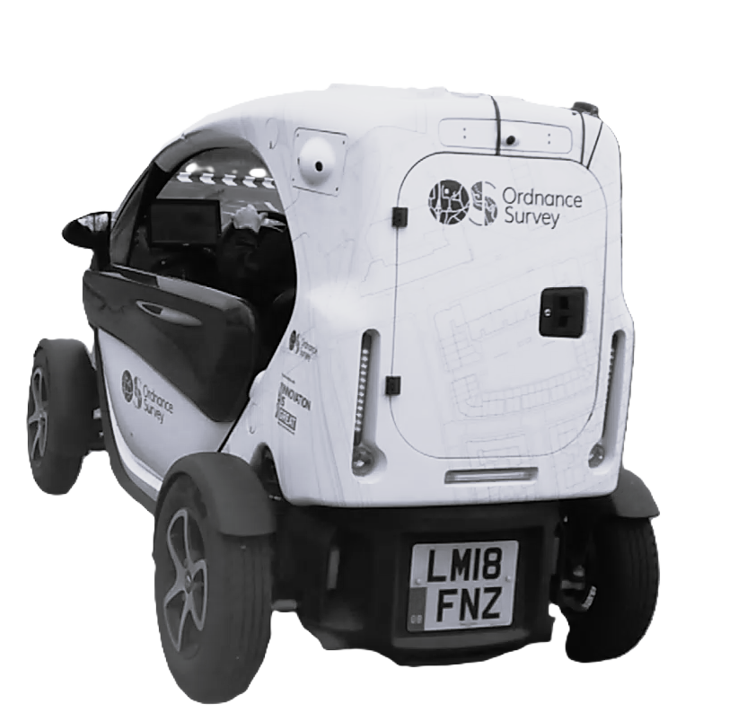
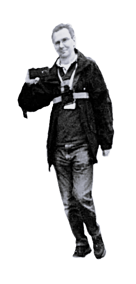
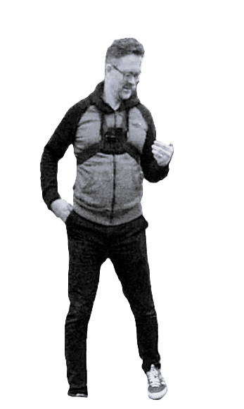

# Metaverse Standards Forum Support Data
This is a subset of the data capture, selected to support prototype development in the Metaverse Standards Forum (MSF) Real/Virtual Integration Working Group. 
The data covers four successful rendezvous between the Ordnance Survey instrumented road vehicle (the "Streetdrone" or the "car") and two people ("rider-3" and "rider 4") wearing chest-mounted 
GoPro 11 cameras.
These two people took the role of potential riders.

The rendezvous were observed by the quadcopter and a person holding a smartphone. The quadcopter had extensivie navigation ond camera positioning sensor data.

The four rendezvous were captured on 26 April, 2023. Participants were from the Ordnance Survey UK, Away Team Software, and OpenSitePlan. The car, the riders, a person with a Nokia 5 smartphone, and a Mavic Pro 2 quadcopter flying about 30 m above the surface 
made video, imagery, position, 
orientation, and image sensor sensor observations throughout the four rendezvous. 

In other data captures during the two days, two additional plaforms - static cameras at a level of about 1.8 m above the surface and aimed along the Ordnance Survey car park perimeter road - were in place. These cameras were not active during the time of this MSF subset and are not included in the listings that follow.

Hillyfields Team: Jeremy, James, Steve, and Rob

## The MSF data

The data capture covered both the static environment (the "stage") as well as the moving entities (the "actors"). 

The actors included the OS Street Drone (1), flying drone (1), instrumented people (2) and non-participant bicyclists, walkers, runners, cars, and trucks. The drones and instrumented people have audio and 10-30 Hz video streams with per-frame IMU and other metadata.

The data is organized by whether it represents elements of the stage, or elements attached to the actors. 
Actor-sensed data is organised by actor ("platform"), "sensor", and data item (such as individual images) or data stream (such as video or navigation data).

## The Stage

We captured two independent reference RGB point clouds (the "reference point clouds") covering the full environment of the capture. One was derived from a late morning aerial survey on 25th April and the other at mid-afternoon of the same day. The nominal positional precision of these point clouds is 2 cm. The point clouds are registered via ground control points to a local LTP-ENU tangent plane coordinate system with an estimated accuracy of 50 cm. Each point cloud has about 140 million samples.

### Orthoimages

**+Image and description here+**

### Pointclouds

**+Image and description here+**

### 3D Models

**+Image and description here+**

### Survey Control points

**+Image and description here+**

## Actors

#### Static Cameras

**+Image and description here+**

### Litter

No litter data was captured for this subset.

**+Image and description here+**

Away Team Software and Highways England provided a variety of road litter including rubbish, temporary road signs, road sign frames, sandbags, and traffic cones.

**++Question: is any of the litter located and visible in any of the imagery in the MSF subset++?**

### Handheld Nokia-5

The Nokia 5  is an Android smartphone equipped with a 13 MP 8-bit RGB pixel camera.

#### Camera-Images

Rider-4 held the Nokia 5 in addition to wearing the chect-mounted camera. No navigation sensor data was captured with the handheld camera. The complete set of images in PNG or Jpeg format is available as a Zip archive:

| Platform.Sensor.Item | Type | Size | Length |
| :---- | :---- | :---- | :---- |
| [Handheld-Nokia-5.Camera-Images.20230426T134102.000_MSF_JPG.zip](https://content.hillyfieldsbubble.org/Data/Bubble/Actors/Handheld-Nokia-5/Handheld-Nokia-5.Camera-Images.20230426T134102.000_MSF_JPG.zip)  | JPG | 9.57 MB | 28 images |
| [Handheld-Nokia-5.Camera-Images.20230426T134102.000_MSF_PNG.zip](https://content.hillyfieldsbubble.org/Data/Bubble/Actors/Handheld-Nokia-5/Handheld-Nokia-5.Camera-Images.20230426T134102.000_MSF_PNG.zip)  | PNG | 44.05 MB | 28 images |

The image files also may be examined or downloaded as [individual files](./handheld_image_list.md).

#### Camera Video

The video frame rate is 29.97 fps.

| Platform.Sensor.Item | Type | Size | Length |
| :---- | :---- | :---- | :---- |
| [Handheld-Nokia-5/Camera-Video/Handheld-Nokia-5.Camera-Video.20230426T134102.000.mp4](https://content.hillyfieldsbubble.org/Data/Bubble/Actors/Handheld-Nokia-5/Camera-Video/Handheld-Nokia-5.Camera-Video.20230426T134102.000.mp4)  | JPG | 36.9 MB | 1 file |

#### Navigation-Sensors

No navigation data is available.

### Mavic 2 Pro - Quadcopter

The DJI Mavic 2 Pro 

 is a small quadcopter equipped with navigation sensors and a 5472 x 3168 8-bit RGB pixel camera.

#### Camera Images

The images are a subset of the frames in the video capture, one frame every two seconds +/- 1 frame time.

The frames are identified by UTC time and are on the same time base as the video. 

JPEG and PNG format images are available in Zip archives:

| Platform.Sensor.Item | Type | Size | Length |
| :---- | :---- | :---- | :---- |
| [Quadcopter.Camera-Images.20230426T134400.500_MSF_JPG.zip](https://content.hillyfieldsbubble.org/Data/Bubble/Actors/Quadcopter/Camera-Images/Quadcopter.Camera-Images.2023-04-26t134400.500_MSF_JPG.zip)  | JPG | 170.2 MB | 203 images |
| [Quadcopter.Camera-Images.20230426T134400.500_MSF_PNG.zip](https://content.hillyfieldsbubble.org/Data/Bubble/Actors/Quadcopter/Camera-Images/Quadcopter.Camera-Images.2023-04-26t134400.500_MSF_PNG.zip)  | JPG | 724.9 MB | 203 images |

The image files also may be examined or downloaded as [individual PNG or Jpeg files](./quadcopter_image_list.md).

#### Camera-Video

The video frame rate is 29.97 fps.

| Platform.Sensor.Item | Type | Size | Length |
| :---- | :---- | :---- | :---- |
| [Handheld-Nokia-5/Camera-Video/Handheld-Nokia-5.Camera-Video.20230426T134102.000.mp4](https://content.hillyfieldsbubble.org/Data/Bubble/Actors/Handheld-Nokia-5/Camera-Video/Handheld-Nokia-5.Camera-Video.20230426T134102.000.mp4)  | JPG | 36.9 MB | 1 file |

#### Navigation-Sensors

The navigation sensors include:

| Observation | Unit | Example |
| :---- | :---- | :---- |
|time|millisecond| 0||
|datetime| UTC ISO 8601| "2023-04-26T13:36:29"||
|latitude| deg |50.9390740274084||
|longitude| deg |-1.47070129923931||
|height_above_takeoff| feet| 18.3||
|height_above_ground_at_drone_location| feet| 23.2||
|ground_elevation_at_drone_location|feet|| 46.954438182332|
|altitude_above_seaLevel|feet|| 46.954438182332|
|height_sonar|feet|| 0.328084|
|speed|mph| 0|
|distance|feet| 0|
|mileage|feet| 0|
|satellites| 14|
|gpslevel| 4|
|voltage|volt| 0|
|max_altitude|feet|| 46.954438182332|
|max_ascent|feet| 0|
|max_speed|mph| 0|
|max_distance|feet|| 0|
|xSpeed|mph| 0|
|ySpeed|mph| 0|
|zSpeed|mph| 0|
|compass_heading|deg| 282.2|
|pitch|deg| 2.5|
|roll|deg|| 0|
|isPhoto| 0/1|0|
|isVideo| 0/1|0|
|rc_elevator| n/a||
|rc_aileron| n/a||
|rc_throttle| n/a||
|rc_rudder| n/a||
|rc_elevator|percent| -100|
|rc_aileron|percent| -100|
|rc_throttle|percent| -100|
|rc_rudder|percent| 100|
|gimbal_heading|deg| 281.9|
|gimbal_pitch|deg| 0|
|gimbal_roll|deg| 0|
|battery_percent|percent| 99|
|voltageCell1|volt|4.104|
|voltageCell2|volt|4.095|
|voltageCell3|volt|4.084|
|voltageCell4|volt|4.103|
|voltageCell5| n/a||
|voltageCell6| n/a||
|current|ampere| 0||
|battery_temperature|deg F|64.4|
|altitude|feet|46.954438182332|
|ascent|feet|0|
|flycStateRaw| n/a||
|flycState| n/a||
|Motors_Started"| n/a||
|message| n/a||

The data are contained in a single Json file with one object containing observations for each sensor for each observation time:

| Platform.Sensor.Item | Type | Size | Length |
| :---- | :---- | :---- | :---- |
| [Quadcopter/Navigation-Sensors/Quadcopter.Navigation-Sensors.2023-04-26t134400.500.json](https://content.hillyfieldsbubble.org/Data/Bubble/Actors/Quadcopter/Navigation-Sensors/Quadcopter.Navigation-Sensors.2023-04-26t134400.500.json)  | JPG | 36.9 MB | 1 file |

### Ordnance Survey Street Drone Front Mount

The OS Streetdrone front cameras.

#### Camera Images

The images are a  subset of the capture, one frame every two seconds. The frames are identified by UTC time and are on the same time base as the video. 
Two formats - JPEG and PNG - are available. A Zip archive of all of the JPEG format images as well as a Zip archive of all of the PNG format images are available.

The frames are identified by UTC time and are on the same time base as the video. 
Two formats - JPEG and PNG - are available. A Zip archive of all of the JPEG format images, a Zip archive of all of the PNG format images. and the individual images files are available.

*The Zip archives:*

| Platform.Sensor.Item | Type | Size | Length |
| :---- | :---- | :---- | :---- |
| [Streetdrone-Front.Camera-Images.20230426T133736.530Z_MSF_JPG.zip](https://content.hillyfieldsbubble.org/Data/Bubble/Actors/Streetdrone-Front/Camera-Images/Streetdrone-Front.Camera-Images.20230426T133736.530Z_MSF_JPG.zip)  | JPG | 170.2 MB | 203 images |
| [Streetdrone-Front.Camera-Images.20230426T133736.530Z_MSF_PNG.zip](https://content.hillyfieldsbubble.org/Data/Bubble/Actors/Streetdrone-Front/Camera-Images/Streetdrone-Front.Camera-Images.20230426T133736.530Z_MSF_PNG.zip)  | JPG | 724.9 MB | 203 images |
| [Streetdrone-Front.Camera-Images.20230426T140336.300Z_MSF_JPG.zip](https://content.hillyfieldsbubble.org/Data/Bubble/Actors/Streetdrone-Front/Camera-Images/Streetdrone-Front.Camera-Images.20230426T140336.504Z_MSF_JPG.zip)  | JPG | 170.2 MB | 203 images |
| [Streetdrone-Front.Camera-Images.20230426T140336.300Z_MSF_PNG.zip](https://content.hillyfieldsbubble.org/Data/Bubble/Actors/Streetdrone-Front/Camera-Images/Streetdrone-Front.Camera-Images.20230426T140336.504Z_MSF_PNG.zip)  | JPG | 724.9 MB | 203 images |

The image files also may be examined or downloaded as [individual PNG or Jpeg files](./streetdrone_front_image_list.md).

#### Camera video

The video frame rate is 4.86 fps.
#### Camera Targets

Objects in the classes "person", "car", "truck", "bicycle", and "motorcycle" were detected with a YOLO V8 CNN trained on the COCO-17 dataset. The class,onfidence, and centre-points are reported. 

### Ordnance Survey Street Drone Rear-Facing Camera

The OS Streetdrone rear cameras.

#### Camera Images

The images are a  subset of the capture, one frame every two seconds. The frames are identified by UTC time and are on the same time base as the video. 
Two formats - JPEG and PNG - are available. A Zip archive of all of the JPEG format images as well as a Zip archive of all of the PNG format images are available.

#### Camera Images

The images are a  subset of the capture, one frame every two seconds. The frames are identified by UTC time and are on the same time base as the video. 
Two formats - JPEG and PNG - are available. A Zip archive of all of the JPEG format images as well as a Zip archive of all of the PNG format images are available.

The frames are identified by UTC time and are on the same time base as the video. 
Two formats - JPEG and PNG - are available. A Zip archive of all of the JPEG format images, a Zip archive of all of the PNG format images. and the individual images files are available.

| Platform.Sensor.Item | Type | Size | Length |
| :---- | :---- | :---- | :---- |
| [Streetdrone-Rear.Camera-Images.20230426T133736.530Z_MSF_JPG.zip](https://content.hillyfieldsbubble.org/Data/Bubble/Actors/Streetdrone-Rear/Camera-Images/Streetdrone-Rear.Camera-Images.20230426T133736.530Z_MSF_JPG.zip)  | JPG | 170.2 MB | 203 images |
| [Streetdrone-Rear.Camera-Images.20230426T133736.530Z_MSF_PNG.zip](https://content.hillyfieldsbubble.org/Data/Bubble/Actors/Streetdrone-Rear/Camera-Images/Streetdrone-Rear.Camera-Images.20230426T133736.530Z_MSF_PNG.zip)  | JPG | 724.9 MB | 203 images |
| [Streetdrone-Rear.Camera-Images.20230426T140336.300Z_MSF_JPG.zip](https://content.hillyfieldsbubble.org/Data/Bubble/Actors/Streetdrone-Rear/Camera-Images/Streetdrone-Rear.Camera-Images.20230426T140336.300Z_MSF_JPG.zip)  | JPG | 170.2 MB | 203 images |
| [Streetdrone-Rear.Camera-Images.20230426T140336.300Z_MSF_PNG.zip](https://content.hillyfieldsbubble.org/Data/Bubble/Actors/Streetdrone-Rear/Camera-Images/Streetdrone-Rear.Camera-Images.20230426T140336.300Z_MSF_PNG.zip)  | JPG | 724.9 MB | 203 images |

The image files also may be examined or downloaded as [individual PNG or Jpeg files](./streetdrone_rear_image_list.md).

#### Camera video

The video frame rate is 4.86 fps.
#### Camera Targets

Objects in the classes "person", "car", "truck", "bicycle", and "motorcycle" were detected with a YOLO V8 CNN trained on the COCO-17 dataset. The class,onfidence, and centre-points are reported. 

#### LiDAR 

#### Pointclouds

Streetdrone [pointcloud data](./Streetdrone_Pointcloud.mp4) derived from the onboard LiDAR is available as a [.laz file](https://content.hillyfieldsbubble.org/Data/Bubble/Actors/StreetDrone-Top/Pointclouds/Streetdrone_Pointcloud.laz) covering the area of the rendezvous.

A [glTF model](./Streetdrone_model.mp4) derived from the pointcloud is available as a [.glb file](https://content.hillyfieldsbubble.org/Data/Bubble/Actors/StreetDrone-Top/Pointclouds/Streetdrone_Model.glb)

#### Navigation-Sensors

The navigation sensors include:

| Observation | Unit | Example |
| :---- | :---- | :---- |
|Time|HH mm ss.fff| "11 02 48.010"|
|Time|GPS µs| 1366542186010000.0000|
|UTC offset|s| -18|
|Time from start of file|mm ss.fff| "188 10.010"|
|Latitude|deg| 50.9389620413194|
|Longitude|deg| -1.47078664837296|
|Altitude|m| 60.588249206543|
|Position accuracy down|m| 0.059|
|Position accuracy east|m| 0.018|
|Position accuracy north|m| 0.019|
|Heading|deg| 237.268830648868|
|Pitch|deg| -1.8420593113456|
|Roll|deg| 0.36285417165635|
|Heading accuracy|deg| 0.0819329647037077|
|Pitch accuracy|deg| 0.103132403123548|
|Roll accuracy|deg| 0.116883390206688|
|Number of GNSS satellites used|| 31|
|GPS position mode|| RTK Integer 6|
|GPS velocity mode|| gxInteger 24|
|GPS dual antenna attitude mode|| ixInteger 29|
|PDOP|| 1.5|
|VDOP|| 1.26885775404495|
|HDOP|| 0.8|

The data are contained in a single Json file with one object containing observations for each sensor for each observation time:

| Platform.Sensor.Item | Type | Size | Length |
| :---- | :---- | :---- | :---- |
| [StreetDrone-Top/Navigation-Sensors/Streetdrone-Top.Navigation-Sensors.20230426T133736.530Z.json](https://content.hillyfieldsbubble.org/Data/Bubble/Actors/StreetDrone-Top/Navigation-Sensors/Streetdrone-Top.Navigation-Sensors.20230426T133736.530Z.json)  | JPG | 30.9 MB | 1 file |

"D:\Staging\Bubble\Actors\StreetDrone-Top\Navigation-Sensors\Streetdrone-Top.Navigation-Sensors.20230426T133736.530Z.json"

### Person - "Rider 3" Chest Mount

The frames are identified by UTC time and are on the same time base as the video. 
Two formats - JPEG and PNG - are available. A Zip archive of all of the JPEG format images, a Zip archive of all of the PNG format images. and the individual images files are available.

#### Camera images
The images are a  subset of the capture, one frame every two seconds. The frames are identified by UTC time and are on the same time base as the video. 
Two formats - JPEG and PNG - are available. A Zip archive of all of the JPEG format images as well as a Zip archive of all of the PNG format images are available.

*The Zip archives:*

| Platform.Sensor.Item | Type | Size | Length |
| :---- | :---- | :---- | :---- |
| [Rider-3-Chest-Mount.Camera-Images.20230426_MSF_JPG.zip](https://content.hillyfieldsbubble.org/Data/Bubble/Actors/Rider-3-Chest-Mount/Camera-Images/Rider-3-Chest-Mount.Camera-Images.20230426_MSF_JPG.zip)  | JPG | 0.52 GB | 180 images |
| [Rider-3-Chest-Mount.Camera-Images.20230426_MSF_PNG.zip](https://content.hillyfieldsbubble.org/Data/Bubble/Actors/Rider-3-Chest-Mount/Camera-Images/Rider-3-Chest-Mount.Camera-Images.20230426_MSF_PNG.zip)  | PNG | 2.33 GB | 180 images |

The individual image files also may be examined or downloaded as [individual PNG or Jpeg files](./rider-3_image_list.md).

#### Camera Video

#### Camera Targets

Objects in the classes "person", "car", "truck", "bicycle", and "motorcycle" were detected with a YOLO V8 CNN trained on the COCO-17 dataset. The class, confidence, and pixel centre-points are reported. 

#### Camera Sensors

### Person - "Rider 4" Chest Mount

#### Camera images
The images are a  subset of the capture, one frame every two seconds. The frames are identified by UTC time and are on the same time base as the video. 
Two formats - JPEG and PNG - are available. A Zip archive of all of the JPEG format images, a Zip archive of all of the PNG format images. and the individual images files are available.

*The Zip archives:*

| Platform.Sensor.Item | Type | Size | Length |
| :---- | :---- | :---- | :---- |
| [Rider-4-Chest-Mount.Camera-Images.20230426_MSF_JPG.zip](https://content.hillyfieldsbubble.org/Data/Bubble/Actors/Rider-4-Chest-Mount/Camera-Images/Rider-4-Chest-Mount.Camera-Images.20230426_MSF_JPG.zip)  | JPG | 0.52 GB | 180 images |
| [Rider-4-Chest-Mount.Camera-Images.20230426_MSF_PNG.zip](https://content.hillyfieldsbubble.org/Data/Bubble/Actors/Rider-4-Chest-Mount/Camera-Images/Rider-4-Chest-Mount.Camera-Images.20230426_MSF_PNG.zip)  | PNG | 2.33 GB | 180 images |

The individual image files also may be examined or downloaded as [individual PNG or Jpeg files](./rider-4_image_list.md).

#### Camera Video

The video frame rate is 29.97 fps.

#### Camera Targets

Objects in the classes "person", "car", "truck", "bicycle", and "motorcycle" were detected with a YOLO V8 CNN trained on the COCO-17 dataset. The class, confidence, and pixel centre-points of each detection are reported. 

#### Camera Sensors

