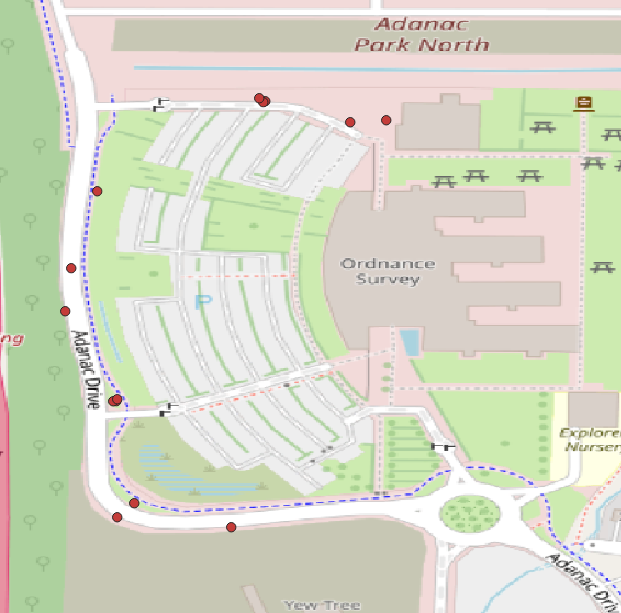
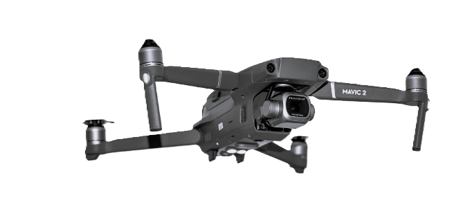

# Metaverse Standards Forum Support Data
This folder contains a subset of the Hillyfields data capture carried out in OGC Testbed-19. The content was selected to support prototype development in the Metaverse Standards Forum (MSF) Real/Virtual Integration Working Group. 
The MSF "Ride-Hailing" use case and a sub-element "visual positioning" are the focus.
The data covers four successful rendezvous between the Ordnance Survey instrumented road vehicle (the "Streetdrone" or the "car") and two people ("rider-3" and "rider 4") wearing chest-mounted 
GoPro 11 cameras.
These two people took the role of riders.

<b>
Team: Jeremy, James, Steve, and Rob
</b>

The rendezvous were also observed by the quadcopter and a person holding a smartphone. The quadcopter had extensivie navigation ond camera positioning sensor data.

The four rendezvous were captured on 26 April, 2023. Participants were from the Ordnance Survey UK, Away Team Software, and OpenSitePlan. The car, the riders, a person with a Nokia 5 smartphone, and a Mavic Pro 2 quadcopter flying about 30 m above the surface 
made video, imagery, position, 
orientation, and image sensor sensor observations throughout the four rendezvous. 

In other data captures during the two days, two additional plaforms - static cameras at a level of about 1.8 m above the surface and aimed along the Ordnance Survey car park perimeter road - were in place. These cameras were not active during the time of this MSF subset and are not included in the listings that follow.

## MSF Data Details

The data capture covered both the static environment (the "stage") as well as the moving entities (the "actors"). 

### Stage and Actors Model

**++ToDo++** stage and actor background

### The Model

The _stage_ and _actors_ paradigm is XXXXX. The S&A model supports YYYYYY.

**++ToDo++**

### Application to the MSF Use Case

The actors included the OS Street Drone (1), flying drone (1), instrumented people (2) and non-participant bicyclists, walkers, runners, cars, and trucks. The drones and instrumented people have audio and 10-30 Hz video streams with per-frame IMU and other metadata.

The data is organized by whether it represents elements of the stage, or elements attached to the actors. 
Actor-sensed data is organised by actor ("platform"), "sensor", and data item (such as individual images) or data stream (such as video or navigation data).

## The Stage

We captured two independent reference RGB point clouds (the "reference point clouds") covering the full environment of the capture. One was derived from a late morning aerial survey on 25th April and the other at mid-afternoon of the same day. The nominal positional precision of these point clouds is 2 cm. The point clouds are registered via ground control points to a local LTP-ENU tangent plane coordinate system with an estimated accuracy of 50 cm. Each point cloud has about 140 million samples.

### Orthoimages

Vertical photo surveys were made in the morning before and in the afternoon after the data capture on April 25th. Using the control points, these were merged into orthophoto mosaics. 

<b>
Morning Orthomosaic with Photo Centres
</b>

also  as Tiff[ image](https://content.hillyfieldsbubble.org/Data/Bubble/Stage/Orthomosaics/Morning/Morning_Orthomosaic.tif) + [world file ](https://content.hillyfieldsbubble.org/Data/Bubble/Stage/Orthomosaics/Morning/Morning_Orthomosaic.tfw), and

<b>
Afternoon Orthomosaic with Photo Centres
</b>

also as Tiff [image](https://content.hillyfieldsbubble.org/Data/Bubble/Stage/Orthomosaics/Afternoon/Afternoon_Orthomosaic.tif) + [world file](https://content.hillyfieldsbubble.org/Data/Bubble/Stage/Orthomosaics/Afternoon/Afternoon_Orthomosaic.tfw)

The primary reason to make morning and afternoon surveys was to sample the different lighting conditions. Sensitivity of image and feature matching performance to the direction of direct lighting is an interesting research topic.

### Pointclouds

Pointclouds were computed photogrammetrically from the survey photos for the morning and afternoon surveys as shown in a vertical view here: 

<b>
Morning Point Cloud Vertical View
</b>

##### Full pointcloud 

| Platform.Sensor.Item | Type | Size | Length |
| :---- | :---- | :---- | :---- |
| [Stage.Pointclouds.Morning.Morning_Point_Cloud.laz](https://content.hillyfieldsbubble.org/Data/Bubble/Stage/Pointclouds/Morning/Morning_Point_Cloud.laz)  | laz | 1.06 GB | 1 file |

Here is a short video that gives a better idea of the coverage and structure of the morning pointcloud:
[morning pointcloud ](https://content.hillyfieldsbubble.org/Data/Bubble/Stage/Pointclouds/Morning/Morning_Survey_Pointcloud.mp4)

The afternoon pointcloud:

<b>
Afternoon Point Cloud Vertical View
</b>

The positions are available in 

| Platform.Sensor.Item | Type | Size | Length |
| :---- | :---- | :---- | :---- |
| [Stage.Pointclouds.Afternoon/Afternoon_Point_Cloud.laz](https://content.hillyfieldsbubble.org/Data/Bubble/Stage/Pointclouds/Afternoon/Afternoon_Point_Cloud.laz)  | laz | 1.06 GB | 1 file |

Here is a that shows the coverage and structure of the Afternoon pointcloud:
[afternoon pointcloud ](https://content.hillyfieldsbubble.org/Data/Bubble/Stage/Pointclouds/Afternoon/Afternoon_Survey_Pointcloud.mp4)

### 3D Models

<b>
ToDo: 3D Models
</b>

The control point positions are available in 

| Platform.Sensor.Item | Type | Size | Length |
| :---- | :---- | :---- | :---- |
| [Stage.Metrics.Control/OS_GCP_HQAP_2.GeoJson](https://content.hillyfieldsbubble.org/Data/Bubble/Stage/Metrics/Control/OS_GCP_HQAP_2.GeoJSON)  | GeoJson | 18.1 KB | 1 file |

### Survey Control points

The Ordnance Survey provided a number of surveyed control points as shown here: 

<b>
Survey Control Points
</b>

The positions are available in 

| Platform.Sensor.Item | Type | Size | Length |
| :---- | :---- | :---- | :---- |
| [Stage.Metrics.Control/OS_GCP_HQAP_2.GeoJson](https://content.hillyfieldsbubble.org/Data/Bubble/Stage/Metrics/Control/OS_GCP_HQAP_2.GeoJSON)  | GeoJson | 18.1 KB | 1 file |

## Actors

The *actors* are objects that are active in some sense. They can have moving parts, be entirely mobile, or be mobile and capable of determining their own motion and orientation. The key factor is that they are active in the context of a fixed background, the *stage*.

### Static Cameras

The static cameras were not used during the collection of the MSF data subset.

### Litter

Away Team Software and Highways England provided a variety of road litter including rubbish, temporary road signs, road sign frames, sandbags, and traffic cones.

Target litter objects were placed at the roadside during filming on 25 and 26 April 2023 to support the litter monitoring use case. 
Thesee fall into two categories:
1. Litter such as:
    * Metal drink cans
    * Plastic bottles - clear & coloured
    * Wooden transportation palettes
 1. Roadworks equipment including:
    * Metal A-frames for road signs
    * Temporary road signs
    * Traffic cones
    * Lights for traffic cones

<b>
Road Litter Examples
</b>

Locations of these objects are provided in a [VMT file](https://content.hillyfieldsbubble.org/Data/Bubble/Actors/Litter/20230426_litter.vmt)  and a [GeoJSON file](https://content.hillyfieldsbubble.org/Data/Bubble/Actors/Litter/Litter.April26.geojson).

<b>
Locations of the 14 Placed Litter Objects
</b>

### Handheld Nokia-5

The Nokia 5  is an Android smartphone equipped with a 13 MP 8-bit RGB pixel camera.

<b>
Nokia 5
</b>

#### Camera-Images

Rider-4 held the Nokia 5 in addition to wearing the chect-mounted camera. No navigation sensor data was captured with the handheld camera. The complete set of images in PNG or Jpeg format is available as a Zip archive:

| Platform.Sensor.Item | Type | Size | Length |
| :---- | :---- | :---- | :---- |
| [Handheld-Nokia-5.Camera-Images.20230426T134102.000_MSF_JPG.zip](https://content.hillyfieldsbubble.org/Data/Bubble/Actors/Handheld-Nokia-5/Handheld-Nokia-5.Camera-Images.20230426T134102.000_MSF_JPG.zip)  | JPG | 9.57 MB | 28 images |
| [Handheld-Nokia-5.Camera-Images.20230426T134102.000_MSF_PNG.zip](https://content.hillyfieldsbubble.org/Data/Bubble/Actors/Handheld-Nokia-5/Handheld-Nokia-5.Camera-Images.20230426T134102.000_MSF_PNG.zip)  | PNG | 44.05 MB | 28 images |

The image files also may be examined or downloaded as [individual files](./handheld_image_list.md).

#### Camera Video

The video frame rate is 29.97 fps.

| Platform.Sensor.Item | Type | Size | Length |
| :---- | :---- | :---- | :---- |
| [Handheld-Nokia-5/Camera-Video/Handheld-Nokia-5.Camera-Video.20230426T134102.000.mp4](https://content.hillyfieldsbubble.org/Data/Bubble/Actors/Handheld-Nokia-5/Camera-Video/Handheld-Nokia-5.Camera-Video.20230426T134102.000.mp4)  | JPG | 36.9 MB | 1 file |

#### Navigation-Sensors

No navigation sensor data was collected from the Handheld camera for the MSF data subset.

### Mavic 2 Pro - Quadcopter

The DJI Mavic 2 Pro 

<b>
DJI Mavic 2 Pro
</b>

 is a small quadcopter equipped with navigation sensors and a 5472 x 3168 8-bit RGB pixel camera.

<b>
Quadcopter MSF Subset Flight Path
</b>

#### Camera Images

The images are a subset of the frames in the video capture, one frame every two seconds +/- 1 frame time.

The frames are identified by UTC time and are on the same time base as the video. 

JPEG and PNG format images are available in Zip archives:

| Platform.Sensor.Item | Type | Size | Length |
| :---- | :---- | :---- | :---- |
| [Quadcopter.Camera-Images.20230426T134400.500_MSF_JPG.zip](https://content.hillyfieldsbubble.org/Data/Bubble/Actors/Quadcopter/Camera-Images/Quadcopter.Camera-Images.2023-04-26t134400.500_MSF_JPG.zip)  | JPG | 170.2 MB | 203 images |
| [Quadcopter.Camera-Images.20230426T134400.500_MSF_PNG.zip](https://content.hillyfieldsbubble.org/Data/Bubble/Actors/Quadcopter/Camera-Images/Quadcopter.Camera-Images.2023-04-26t134400.500_MSF_PNG.zip)  | JPG | 724.9 MB | 203 images |

The image files also may be examined or downloaded as [individual PNG or Jpeg files](./quadcopter_image_list.md).

#### Camera-Video

The video frame rate is 29.97 fps.

| Platform.Sensor.Item | Type | Size | Length |
| :---- | :---- | :---- | :---- |
| [Handheld-Nokia-5/Camera-Video/Handheld-Nokia-5.Camera-Video.20230426T134102.000.mp4](https://content.hillyfieldsbubble.org/Data/Bubble/Actors/Handheld-Nokia-5/Camera-Video/Handheld-Nokia-5.Camera-Video.20230426T134102.000.mp4)  | JPG | 36.9 MB | 1 file |

#### Navigation-Sensors

The navigation sensors include:

| Observation | Unit | Example |
| :---- | :---- | :---- |
|time|millisecond| 0||
|datetime| UTC ISO 8601| "2023-04-26T13:36:29"||
|latitude| deg |50.9390740274084||
|longitude| deg |-1.47070129923931||
|height_above_takeoff| feet| 18.3||
|height_above_ground_at_drone_location| feet| 23.2||
|ground_elevation_at_drone_location|feet|| 46.954438182332|
|altitude_above_seaLevel|feet|| 46.954438182332|
|height_sonar|feet|| 0.328084|
|speed|mph| 0|
|distance|feet| 0|
|mileage|feet| 0|
|satellites| 14|
|gpslevel| 4|
|voltage|volt| 0|
|max_altitude|feet|| 46.954438182332|
|max_ascent|feet| 0|
|max_speed|mph| 0|
|max_distance|feet|| 0|
|xSpeed|mph| 0|
|ySpeed|mph| 0|
|zSpeed|mph| 0|
|compass_heading|deg| 282.2|
|pitch|deg| 2.5|
|roll|deg|| 0|
|isPhoto| 0/1|0|
|isVideo| 0/1|0|
|rc_elevator| n/a||
|rc_aileron| n/a||
|rc_throttle| n/a||
|rc_rudder| n/a||
|rc_elevator|percent| -100|
|rc_aileron|percent| -100|
|rc_throttle|percent| -100|
|rc_rudder|percent| 100|
|gimbal_heading|deg| 281.9|
|gimbal_pitch|deg| 0|
|gimbal_roll|deg| 0|
|battery_percent|percent| 99|
|voltageCell1|volt|4.104|
|voltageCell2|volt|4.095|
|voltageCell3|volt|4.084|
|voltageCell4|volt|4.103|
|voltageCell5| n/a||
|voltageCell6| n/a||
|current|ampere| 0||
|battery_temperature|deg F|64.4|
|altitude|feet|46.954438182332|
|ascent|feet|0|
|flycStateRaw| n/a||
|flycState| n/a||
|Motors_Started"| n/a||
|message| n/a||

The data are contained in a single Json file with one object containing observations for each sensor for each observation time:

| Platform.Sensor.Item | Type | Size | Length |
| :---- | :---- | :---- | :---- |
| [Quadcopter/Navigation-Sensors/Quadcopter.Navigation-Sensors.2023-04-26t134400.500.json](https://content.hillyfieldsbubble.org/Data/Bubble/Actors/Quadcopter/Navigation-Sensors/Quadcopter.Navigation-Sensors.2023-04-26t134400.500.json)  | JPG | 36.9 MB | 1 file |

### Ordnance Survey Streetdrone Front-Facing Camera

<b>
OS Streetdrone Front Camera Location
</b>

The OS Streetdrone front camera location.

#### Camera Images

The images are a  subset of the capture, one frame every two seconds. The frames are identified by UTC time and are on the same time base as the video. 
Two formats - JPEG and PNG - are available. A Zip archive of all of the JPEG format images as well as a Zip archive of all of the PNG format images are available.

The frames are identified by UTC time and are on the same time base as the video. 
Two formats - JPEG and PNG - are available. A Zip archive of all of the JPEG format images, a Zip archive of all of the PNG format images. and the individual images files are available.

##### Zip archives

| Platform.Sensor.Item | Type | Size | Length |
| :---- | :---- | :---- | :---- |
| [Streetdrone-Front.Camera-Images.20230426T133736.530Z_MSF_JPG.zip](https://content.hillyfieldsbubble.org/Data/Bubble/Actors/Streetdrone-Front/Camera-Images/Streetdrone-Front.Camera-Images.20230426T133736.530Z_MSF_JPG.zip)  | JPG | 170.2 MB | 203 images |
| [Streetdrone-Front.Camera-Images.20230426T133736.530Z_MSF_PNG.zip](https://content.hillyfieldsbubble.org/Data/Bubble/Actors/Streetdrone-Front/Camera-Images/Streetdrone-Front.Camera-Images.20230426T133736.530Z_MSF_PNG.zip)  | JPG | 724.9 MB | 203 images |
| [Streetdrone-Front.Camera-Images.20230426T140336.300Z_MSF_JPG.zip](https://content.hillyfieldsbubble.org/Data/Bubble/Actors/Streetdrone-Front/Camera-Images/Streetdrone-Front.Camera-Images.20230426T140336.504Z_MSF_JPG.zip)  | JPG | 170.2 MB | 203 images |
| [Streetdrone-Front.Camera-Images.20230426T140336.300Z_MSF_PNG.zip](https://content.hillyfieldsbubble.org/Data/Bubble/Actors/Streetdrone-Front/Camera-Images/Streetdrone-Front.Camera-Images.20230426T140336.504Z_MSF_PNG.zip)  | JPG | 724.9 MB | 203 images |

##### Individual images

The image files also may be examined or downloaded as [individual PNG or Jpeg files](./streetdrone_front_image_list.md).

#### Camera video

The video frame rate is 4.86 fps.

**++ToDo++** video links

#### Camera Targets

Objects in the classes "person", "car", "truck", "bicycle", and "motorcycle" were detected with a YOLO V8 CNN trained on the COCO-17 dataset. The class,onfidence, and centre-points are reported. 

**++ToDo++** target files links

### Ordnance Survey Street Drone Rear-Facing Camera

<b>
OS Streetdrone Rear Camera Location
</b>

The OS Streetdrone rear camera location.

#### Camera Images

The images are a subset of the capture, one frame every two seconds. The frames are identified by UTC time and are on the same time base as the video. 
Two formats - JPEG and PNG - are available. A Zip archive of all of the JPEG format images as well as a Zip archive of all of the PNG format images are available.

#### Camera Images

The images are a  subset of the capture, one frame every two seconds. The frames are identified by UTC time and are on the same time base as the video. 
Two formats - JPEG and PNG - are available. A Zip archive of all of the JPEG format images as well as a Zip archive of all of the PNG format images are available.

The frames are identified by UTC time and are on the same time base as the video. 
Two formats - JPEG and PNG - are available. A Zip archive of all of the JPEG format images, a Zip archive of all of the PNG format images. and the individual images files are available.

| Platform.Sensor.Item | Type | Size | Length |
| :---- | :---- | :---- | :---- |
| [Streetdrone-Rear.Camera-Images.20230426T133736.530Z_MSF_JPG.zip](https://content.hillyfieldsbubble.org/Data/Bubble/Actors/Streetdrone-Rear/Camera-Images/Streetdrone-Rear.Camera-Images.20230426T133736.530Z_MSF_JPG.zip)  | JPG | 170.2 MB | 203 images |
| [Streetdrone-Rear.Camera-Images.20230426T133736.530Z_MSF_PNG.zip](https://content.hillyfieldsbubble.org/Data/Bubble/Actors/Streetdrone-Rear/Camera-Images/Streetdrone-Rear.Camera-Images.20230426T133736.530Z_MSF_PNG.zip)  | JPG | 724.9 MB | 203 images |
| [Streetdrone-Rear.Camera-Images.20230426T140336.300Z_MSF_JPG.zip](https://content.hillyfieldsbubble.org/Data/Bubble/Actors/Streetdrone-Rear/Camera-Images/Streetdrone-Rear.Camera-Images.20230426T140336.300Z_MSF_JPG.zip)  | JPG | 170.2 MB | 203 images |
| [Streetdrone-Rear.Camera-Images.20230426T140336.300Z_MSF_PNG.zip](https://content.hillyfieldsbubble.org/Data/Bubble/Actors/Streetdrone-Rear/Camera-Images/Streetdrone-Rear.Camera-Images.20230426T140336.300Z_MSF_PNG.zip)  | JPG | 724.9 MB | 203 images |

The image files also may be examined or downloaded as [individual PNG or Jpeg files](./streetdrone_rear_image_list.md).

#### Camera video

The video frame rate is 4.86 fps.

**++ToDo++** links to videos

#### Camera Targets

Objects in the classes "person", "car", "truck", "bicycle", and "motorcycle" were detected with a YOLO V8 CNN trained on the COCO-17 dataset. The class, confidence, and centre-points are reported. 

**++ToDo++** links to targets fles

#### LiDAR 

**++ToDo++** links to lidar

#### Pointclouds

Streetdrone [pointcloud data](https://content.hillyfieldsbubble.org/Data/Bubble/Actors/StreetDrone-Top/Pointclouds/Streetdrone_Pointcloud.mp4) derived from the onboard LiDAR is available as a [.laz file](https://content.hillyfieldsbubble.org/Data/Bubble/Actors/StreetDrone-Top/Pointclouds/Streetdrone_Pointcloud.laz) covering the area of the rendezvous.

A [glTF model](https://content.hillyfieldsbubble.org/Data/Bubble/Actors/StreetDrone-Top/Pointclouds//Streetdrone_model.mp4) derived from the pointcloud is available as a [.glb file](https://content.hillyfieldsbubble.org/Data/Bubble/Actors/StreetDrone-Top/Pointclouds/Streetdrone_Model.glb)

#### Navigation-Sensors

The navigation sensors include:

| Observation | Unit | Example |
| :---- | :---- | :---- |
|Time|HH mm ss.fff| "11 02 48.010"|
|Time|GPS µs| 1366542186010000.0000|
|UTC offset|s| -18|
|Time from start of file|mm ss.fff| "188 10.010"|
|Latitude|deg| 50.9389620413194|
|Longitude|deg| -1.47078664837296|
|Altitude|m| 60.588249206543|
|Position accuracy down|m| 0.059|
|Position accuracy east|m| 0.018|
|Position accuracy north|m| 0.019|
|Heading|deg| 237.268830648868|
|Pitch|deg| -1.8420593113456|
|Roll|deg| 0.36285417165635|
|Heading accuracy|deg| 0.0819329647037077|
|Pitch accuracy|deg| 0.103132403123548|
|Roll accuracy|deg| 0.116883390206688|
|Number of GNSS satellites used|| 31|
|GPS position mode|| RTK Integer 6|
|GPS velocity mode|| gxInteger 24|
|GPS dual antenna attitude mode|| ixInteger 29|
|PDOP|| 1.5|
|VDOP|| 1.26885775404495|
|HDOP|| 0.8|

The data are contained in a single Json file with one object containing observations for each sensor for each observation time:

| Platform.Sensor.Item | Type | Size | Length |
| :---- | :---- | :---- | :---- |
| [StreetDrone-Top/Navigation-Sensors/Streetdrone-Top.Navigation-Sensors.20230426T133736.530Z.json](https://content.hillyfieldsbubble.org/Data/Bubble/Actors/StreetDrone-Top/Navigation-Sensors/Streetdrone-Top.Navigation-Sensors.20230426T133736.530Z.json)  | JPG | 30.9 MB | 1 file |

"D:\Staging\Bubble\Actors\StreetDrone-Top\Navigation-Sensors\Streetdrone-Top.Navigation-Sensors.20230426T133736.530Z.json"

### Person - "Rider 3" Chest Mount

<b>
Rider 3
</b>

The frames are identified by UTC time and are on the same time base as the video. 
Two formats - JPEG and PNG - are available. A Zip archive of all of the JPEG format images, a Zip archive of all of the PNG format images. and the individual images files are available.

#### Camera images

The images are a  subset of the capture, one frame every two seconds. The frames are identified by UTC time and are on the same time base as the video. 
Two formats - JPEG and PNG - are available. A Zip archive of all of the JPEG format images as well as a Zip archive of all of the PNG format images are available.

##### The Zip archives

| Platform.Sensor.Item | Type | Size | Length |
| :---- | :---- | :---- | :---- |
| [Rider-3-Chest-Mount.Camera-Images.20230426_MSF_JPG.zip](https://content.hillyfieldsbubble.org/Data/Bubble/Actors/Rider-3-Chest-Mount/Camera-Images/Rider-3-Chest-Mount.Camera-Images.20230426_MSF_JPG.zip)  | JPG | 0.52 GB | 180 images |
| [Rider-3-Chest-Mount.Camera-Images.20230426_MSF_PNG.zip](https://content.hillyfieldsbubble.org/Data/Bubble/Actors/Rider-3-Chest-Mount/Camera-Images/Rider-3-Chest-Mount.Camera-Images.20230426_MSF_PNG.zip)  | PNG | 2.33 GB | 180 images |

The individual image files also may be examined or downloaded as [individual PNG or Jpeg files](./rider-3_image_list.md).

#### Camera Video

**++ToDo++** links to videos

#### Camera Targets

Objects in the classes "person", "car", "truck", "bicycle", and "motorcycle" were detected with a YOLO V8 CNN trained on the COCO-17 dataset. The class, confidence, and pixel centre-points are reported. 

**++ToDo++** links to targets

#### Navigation Sensors

**++ToDo++** links to sensor files

### Person - "Rider 4" Chest Mount

<b>
Rider 4
</b>

#### Camera Images

The images are a  subset of the capture, one frame every two seconds. The frames are identified by UTC time and are on the same time base as the video. 
Two formats - JPEG and PNG - are available. A Zip archive of all of the JPEG format images, a Zip archive of all of the PNG format images. and the individual images files are available.

##### Zip archives

| Platform.Sensor.Item | Type | Size | Length |
| :---- | :---- | :---- | :---- |
| [Rider-4-Chest-Mount.Camera-Images.20230426_MSF_JPG.zip](https://content.hillyfieldsbubble.org/Data/Bubble/Actors/Rider-4-Chest-Mount/Camera-Images/Rider-4-Chest-Mount.Camera-Images.20230426_MSF_JPG.zip)  | JPG | 0.52 GB | 180 images |
| [Rider-4-Chest-Mount.Camera-Images.20230426_MSF_PNG.zip](https://content.hillyfieldsbubble.org/Data/Bubble/Actors/Rider-4-Chest-Mount/Camera-Images/Rider-4-Chest-Mount.Camera-Images.20230426_MSF_PNG.zip)  | PNG | 2.33 GB | 180 images |

The individual image files also may be examined or downloaded as [individual PNG or Jpeg files](./rider-4_image_list.md).

#### Camera Video

The video frame rate is 29.97 fps.

**++ToDo++** links to videos

#### Camera Targets

Objects in the classes "person", "car", "truck", "bicycle", and "motorcycle" were detected with a YOLO V8 CNN trained on the COCO-17 dataset. The class, confidence, and pixel centre-points of each detection are reported. 

**++ToDo++** links to target files

#### Navigation Sensors

**++ToDo++** links to navigation sensor files

