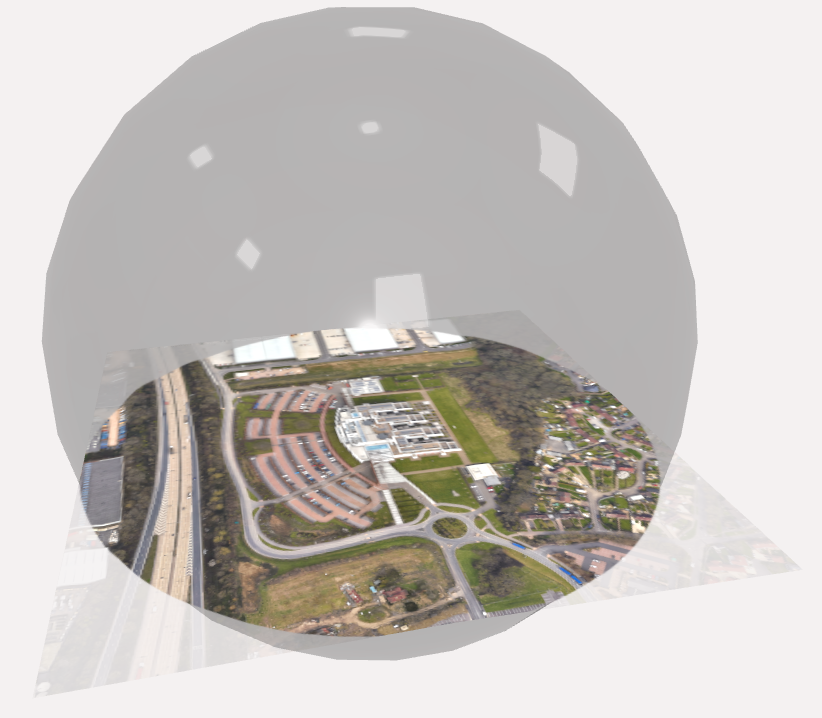

# Releases

This is the public access point for content derived from the April 2023 Hillyfields Bubble Data Capture. 

## Descriptions
The initial data capture was on 25-26 April, 2023 at and near the headquarters of the Ordnance Survey UK. Participants from the Ordnance Survey UK, Away Team Software, and OpenSitePlan made position, orientation, and image sensor observations via an instrumented road vehicle (the "street drone" or the "car"), a person wearing a chest-mounted GoPro camera (the "rider"), a flying drone (the "drone"), and two fixed video cameras (the "static cameras", also positioned and oriented.

## Structure of the Data

### Static Data

We captured two independent reference RGB point clouds (the "reference point clouds") covering the full environment of the capture. One was derived from a late morning aerial survey on 25th April and the other at mid-afternoon of the same day. The nominal positional precision of these point clouds is 2 cm. The point clouds are registered via ground control points to a local LTP-ENU tangent plane coordinate system with an estimated accuracy of 50 cm. Each point cloud has about 140 milllion samples. 

### Portable Entities

Away Team Software and Highways England provided a variety of road litter including rubbish, road hazards, signs, sign frames, sandbags, and car parts. 

### Self-Mobile Entities

OS Street Drone (1), flying drone (1), instrumented people (2) and non-participant bicyclists, walkers, runners, cars, and trucks. The drones and instrumented people have audio and 10-30 Hz video streams with per-frame IMU and other metadata.

### Sensed Data

Hierarchical breakdown by sensor platform and sensor.
Data from each sensor is available in time series form.

### Derived Data

Derived data is computed from the sensed data and certain ancillary environmental data, such as the angular position of the sun. The primary type of derived data is position and orientation of mobile entities. This information is derived from a combination of sensed data and application of physical and geometrical constraints. Identifying derived data makes it possible for downstrean users of the captured data to use their own algorithms, if they choose.

